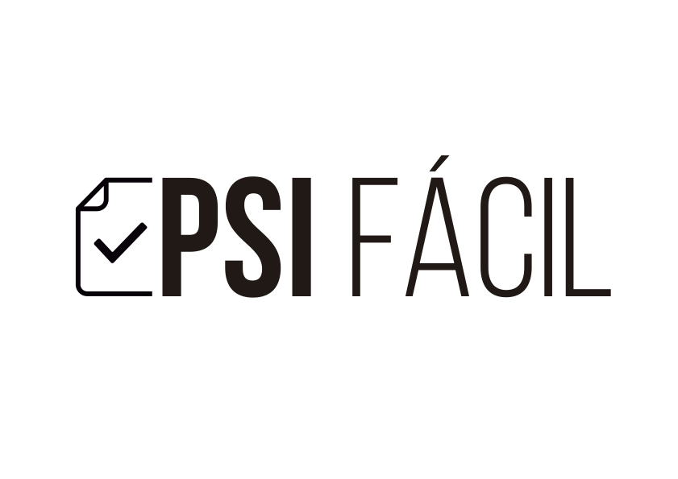

# psi-facil

Guia simples de políticas de segurança da informação para micro e pequenas empresas.

## Introdução

A cada dia cresce o número de informações produzidas por uma empresa. Desde documentos produzidos em meio digital, impressas ou faladas são ativos valiosos. A dependência de recursos tecnológicos é cada vez mais perceptível a partir do momento que uma empresa realiza seu processo de produção, venda, estoque e logística. Muitas vezes os empresários veem valor no processo de produção e cadeia de suprimentos, porém se esquecem dos cuidados com a vanguarda tecnológica. Desta forma, um fator que é importantíssimo de ser cuidado são as informações, o bem maior produzido por uma organização. Com esta preocupação e as devidas medidas de proteção garantirão a proteção e disponibilização das informações quando necessário. A Segurança da Informação então tem o papel de proteger as informações contra as inúmeras ameaças existentes, seja através de fatores humanos e não-humanos. A Gestão da Segurança da Informação em uma empresa tem o objetivo de garantir:

- Gestão de riscos
- Garantir a continuidade dos serviços
- Atuar como parceira de negócios
- Promover o suporte necessário para execução dos serviços.

Desta forma, o presente documento tem o objetivo de ser um modelo simplificado e eficiente para utilização de micro, pequenas e médias empresas, a fim de nortear para a instrução de seus colaboradores quanto a importância e a proteção dos dados produzidos pela organização. Utilizando como base a norma da ISO/IEC 27002:2013, apresentaremos através de tópicos os principais itens de atenção para proteção das informações.

## Compreendendo uma Política de Segurança da Informação

A Política de Segurança da Informação é um documento de orientação que prediz baseado em melhores práticas do mercado o que a empresa espera e orienta quanto ao uso de dispositivos tecnológicos. A partir da leitura, o colaborador fica ciente através de ações os ponto de atenção e cuidado, bem como o que é e o que ou não é permitido no âmbito do trabalho bem como seu papel no processo de garantia da proteção das informações e as penalidades aplicáveis em caso de desvio de conduta. 

## Público-alvo deste Documento

Este documento é destinado a todas as organizações que pretendem desenvolver uma política de segurança da informação. Através de sugestões baseadas na norma ISO.27002, que retrata sobre Segurança da Informação, as empresas poderão escolher  os itens que melhor irão compor a sua política.
Ressalta-se que o desenvolvimento da política em âmbito organizacional deve ser conduzida pelo setor de alta gestão, setor jurídico balizando as possibilidades escolhidas, bem como departamento pessoal e setor de TI.

## Quanto às responsabilidades

O documento a seguir têm caráter orientativo. O desenvolvimento e aplicação da política de segurança da informação é de responsabilidade única da empresa alvo.

## Regras Gerais

Após o desenvolvimento da política de acordo com os interesses da empresa, sugerimos que este seja disponibilizado de forma impressa e de fácil localização para toda a empresa. Deve ser comunicado e envolvido todo corpo administrativo e gerencial.  É sugerido que as políticas de segurança da informação sejam revisadas anualmente pelo setor de Tecnologia da Informação juntamente a diretoria administrativa, e suas cláusulas serão modificadas, acrescidas ou diminuídas em votações por maioria de votos.

## Princípios de Segurança da Informação

Os presentes capítulos dispostos a seguir estão de acordo com as premissas básicas para Segurança da Informação, através da norma ABNT ISO/IEC 27002:2013.

## Premissas básicas para a criação de uma Política de Segurança da Informação

- As informações da empresa, dos clientes e do público em geral devem ser tratadas de forma ética e sigilosa e de acordo com as leis vigentes e normas internas, evitando-se mau uso e exposição indevida.
- A informação deve ser utilizada de forma transparente e apenas para a finalidade para a qual foi coletada.
- O acesso às informações e recursos só deve ser feito se devidamente autorizado.
- A identificação de qualquer Colaborador deve ser única, pessoal e intransferível, qualificando-o como responsável pelas ações realizadas.
- Os riscos às informações da Instituição devem ser reportados à área de Segurança da Informação/direção.
- As responsabilidades quanto à Segurança da Informação devem ser amplamente divulgadas aos Colaboradores, que devem entender e assegurar estas diretrizes.
